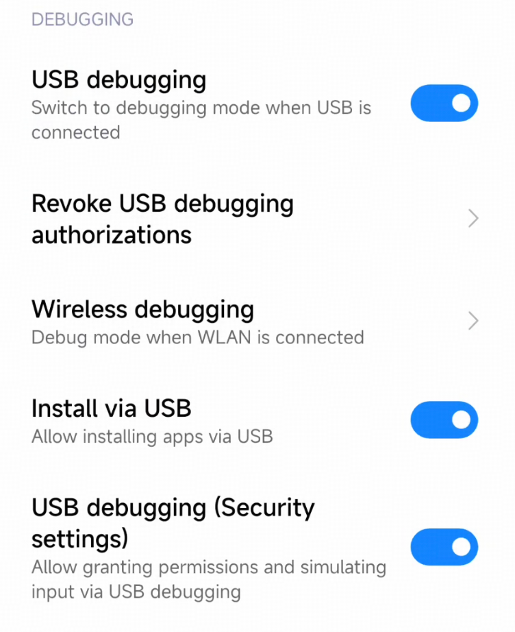
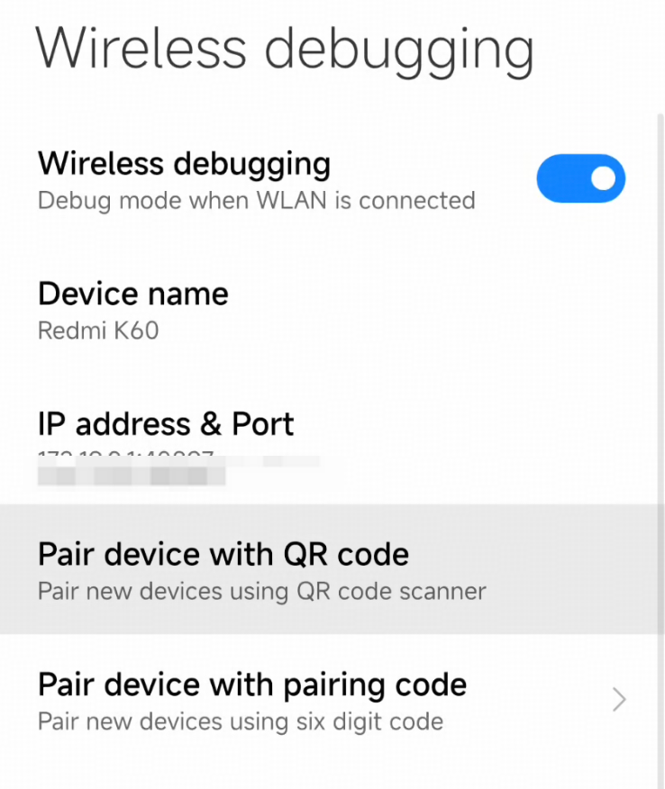

# ContentSwarm

**Viral Content Automation System for Multi-Phone Management**

---

## 🚀 What is ContentSwarm?

ContentSwarm is a complete viral content automation system that manages up to **20 Android phones simultaneously** to create and distribute viral content across multiple social media platforms.

**The Ultimate Content Pipeline:**
- 📱 **Control 20 Phones** from one dashboard
- 🎨 **FREE Content Generation** with ComfyUI (save $750-1,500/month)
- 🤖 **Automated Distribution** across TikTok, Instagram, YouTube, Twitter, Facebook
- 📺 **Live Screen Streaming** to monitor all phones in real-time
- 💰 **Cost Savings**: Generate unlimited content locally instead of paying per video

**Perfect for:**
- Content creators managing multiple accounts
- Social media agencies scaling operations
- Marketers testing content across platforms
- Anyone wanting to automate viral content creation

---

## 🧠 Driving ContentSwarm from Orphus

ContentSwarm's core job is the **mobile phone interface**: multi-device control
and app control. The [Orphus agent harness](https://github.com/kelvincushman/orphus)
is the main driver — its agents operate the fleet through the `contentswarm`
CLI against the REST API (`/api/v1`).

```bash
# On the server:
./deploy/install_aiserver.sh          # systemd service: API + dashboard on :5000

# On the Orphus machine:
./orphus/install.sh                   # installs skills, phone-operator agent, fleet
pip install -e .                      # provides the `contentswarm` CLI
export CONTENTSWARM_API_URL="http://<server-ip>:5000/api/v1"
contentswarm phones
contentswarm run phone_01 "Open TikTok and scroll trending" --wait
```

👉 **[Orphus Integration](orphus/README.md)** | **[AI Server Setup](deploy/AISERVER_SETUP.md)**

---

## 🎉 Key Features

### 📱 Multi-Phone Control (20 Phones)
- **Phone Pool Management**: Control 20 phones from one central agent with sequential switching
- **Wireless ADB**: Connect phones via WiFi for cable-free operation
- **Batch Operations**: Run tasks across multiple phones in parallel
- **Configuration-Based**: JSON-based phone configuration for easy management

👉 **[Complete Guide](PHONE_POOL_GUIDE.md)** | **[Quick Start](QUICK_START.md)**

### 🎨 FREE Content Generation with ComfyUI
- **Local Generation**: Generate unlimited images and videos on your RTX GPU
- **Cost Savings**: Save $750-1,500/month vs. paid APIs like Veo3
- **High Quality**: SDXL for images, AnimateDiff for videos
- **Platform-Specific**: Custom workflows for TikTok, Instagram, YouTube Shorts

👉 **[ComfyUI Setup Guide](COMFYUI_SETUP.md)** | **[RTX 5060 16GB Optimization](COMFYUI_SETUP.md#rtx-5060-16gb-optimization)**

### 🤖 Social Media Automation Pipeline
- **Discover**: Find trending content across TikTok, Instagram, YouTube, Twitter, Facebook
- **Analyze**: Use 12labs AI to analyze viral videos
- **Generate**: Create content with ComfyUI (FREE!) or Veo3
- **Post**: Automatically distribute to all platforms using phone pool

👉 **[Viral Content Strategy Guide](VIRAL_CONTENT_GUIDE.md)**

### 🖥️ Real-Time Web Dashboard
- **Live Monitoring**: Monitor all 20 phones in real-time
- **Phone Control**: Select and control any phone from the web interface
- **Content Generation**: Manage ComfyUI generation queue
- **Automation**: Start/stop viral content pipeline
- **Analytics**: Track performance across all platforms

👉 **[Dashboard Documentation](dashboard/README.md)**

### 📺 Live Screen Streaming
- **Multi-Phone View**: See all 20 phone screens simultaneously
- **Resizable Grid**: Adjust thumbnail size (100-250px)
- **Toggleable**: Turn individual phone streams on/off to save bandwidth
- **Click to Enlarge**: Select any phone for full-screen viewing
- **Bandwidth Optimized**: ~4-6 Mbps for all 20 phones

👉 **[Screen Streaming Analysis](SCREEN_STREAMING_ANALYSIS.md)**

---

## 💰 Cost Comparison

**Traditional Approach (Veo3 API):**
- Video Generation: $5-10 per video
- Monthly Cost: $750-1,500 (for 5 videos/day)

**ContentSwarm with ComfyUI:**
- Video Generation: FREE (local GPU)
- Monthly Cost: ~$10 (electricity)
- **Savings: $740-1,490/month**

---

## 🚀 Quick Start

### Prerequisites

- **20 Android phones** (Android 7.0+) with USB debugging enabled
- **RTX GPU** (RTX 5060 16GB or better recommended for content generation)
- **Python 3.10+**
- **ADB installed** ([Download](https://developer.android.com/tools/releases/platform-tools))

### Installation

```bash
# 1. Clone repository
git clone <your-repo-url>
cd ContentSwarm

# 2. Install dependencies
pip install -r requirements.txt
pip install -e .
cd dashboard && pip install -r requirements.txt

# 3. Setup ComfyUI (for FREE content generation)
# See COMFYUI_SETUP.md for complete guide

# 4. Configure your 20 phones
# Edit phones_config.json with your phone IPs

# 5. Start the dashboard
cd dashboard
python app.py

# 6. Open http://localhost:5000
# - View all phones in real-time
# - Generate content with ComfyUI
# - Run automation pipeline
```

**Complete Setup Guide**: [QUICK_START.md](QUICK_START.md)

**System Overview**: [SYSTEM_OVERVIEW.md](SYSTEM_OVERVIEW.md)

---

## 📖 Core Concepts

### Phone Agent Framework

ContentSwarm is built on a phone agent framework that:
- **Input**: Natural language instructions (e.g., "Open TikTok and post this video")
- **Output**: Automatically operates Android phones to complete tasks
- **Mechanism**: Screenshot → Vision model understands interface → Outputs tap coordinates → ADB executes actions → Loop

### How It Works

1. **Connect Phones**: 20 phones connected via wireless ADB
2. **Control System**: Python agent controls phones sequentially
3. **Vision Model**: AI understands phone screens and plans actions
4. **Content Generation**: ComfyUI generates videos locally on your GPU
5. **Distribution**: Automated posting across all platforms

---

## 🛠️ Environment Setup

### 1. Python Environment

Python 3.10 or higher is recommended.

### 2. ADB (Android Debug Bridge)

1. Download the official ADB [installation package](https://developer.android.com/tools/releases/platform-tools) and extract it to a custom path
2. Configure environment variables

- MacOS configuration: In `Terminal` or any command line tool

  ```bash
  # Assuming the extracted directory is ~/Downloads/platform-tools. Adjust the command if different.
  export PATH=${PATH}:~/Downloads/platform-tools
  ```

- Windows configuration: Refer to [third-party tutorials](https://blog.csdn.net/x2584179909/article/details/108319973) for configuration.

### 3. Android 7.0+ Device or Emulator with Developer Mode and USB Debugging Enabled

1. Enable Developer Mode: The typical method is to find `Settings > About Phone > Build Number` and tap it rapidly about 10 times until a popup shows "Developer mode has been enabled." This may vary slightly between phones; search online for tutorials if you can't find it.
2. Enable USB Debugging: After enabling Developer Mode, go to `Settings > Developer Options > USB Debugging` and enable it
3. Some devices may require a restart after setting developer options for them to take effect. You can test by connecting your phone to your computer via USB cable and running `adb devices` to see if device information appears. If not, the connection has failed.

**Please carefully check the relevant permissions**



### 4. Install ADB Keyboard (for Text Input)

Download the [installation package](https://github.com/senzhk/ADBKeyBoard/blob/master/ADBKeyboard.apk) and install it on the corresponding Android device.
Note: After installation, you need to enable `ADB Keyboard` in `Settings > Input Method` or `Settings > Keyboard List` for it to work. (or use command `adb shell ime enable com.android.adbkeyboard/.AdbIME` [How-to-use](https://github.com/senzhk/ADBKeyBoard/blob/master/README.md#how-to-use))

---

## 📦 Deployment

### 1. Install Dependencies

```bash
pip install -r requirements.txt
pip install -e .
```

### 2. Configure ADB

Make sure your **USB cable supports data transfer**, not just charging.

Ensure ADB is installed and connect the device via **USB cable**:

```bash
# Check connected devices
adb devices

# Output should show your device, e.g.:
# List of devices attached
# emulator-5554   device
```

### 3. Start Model Service

ContentSwarm uses vision-language models to understand phone screens and plan actions.

#### Option A: Use Third-Party Model Services

If you don't want to deploy the model yourself, you can use the following third-party services:

**1. z.ai**

- Documentation: https://docs.z.ai/api-reference/introduction
- `--base-url`: `https://api.z.ai/api/paas/v4`
- `--model`: `autoglm-phone-multilingual`
- `--apikey`: Apply for your own API key on the z.ai platform

**2. Novita AI**

- Documentation: https://novita.ai/models/model-detail/zai-org-autoglm-phone-9b-multilingual
- `--base-url`: `https://api.novita.ai/openai`
- `--model`: `zai-org/autoglm-phone-9b-multilingual`
- `--apikey`: Apply for your own API key on the Novita AI platform

**3. Parasail**

- Documentation: https://www.saas.parasail.io/serverless?name=auto-glm-9b-multilingual
- `--base-url`: `https://api.parasail.io/v1`
- `--model`: `parasail-auto-glm-9b-multilingual`
- `--apikey`: Apply for your own API key on the Parasail platform

Example usage with third-party services:

```bash
# Using z.ai
python main.py --base-url https://api.z.ai/api/paas/v4 --model "autoglm-phone-multilingual" --apikey "your-z-ai-api-key" "Open Chrome browser"

# Using Novita AI
python main.py --base-url https://api.novita.ai/openai --model "zai-org/autoglm-phone-9b-multilingual" --apikey "your-novita-api-key" "Open Chrome browser"

# Using Parasail
python main.py --base-url https://api.parasail.io/v1 --model "parasail-auto-glm-9b-multilingual" --apikey "your-parasail-api-key" "Open Chrome browser"
```

#### Option B: Deploy Model Yourself

If you prefer to deploy the model locally or on your own server:

1. Download a compatible vision-language model (GLM-4.1V-9B-Thinking architecture)
2. Start via SGlang / vLLM to get an OpenAI-format service. Here's a vLLM deployment solution:

```shell
python3 -m vllm.entrypoints.openai.api_server \
 --served-model-name autoglm-phone-9b-multilingual \
 --allowed-local-media-path /   \
 --mm-encoder-tp-mode data \
 --mm_processor_cache_type shm \
 --mm_processor_kwargs "{\"max_pixels\":5000000}" \
 --max-model-len 25480  \
 --chat-template-content-format string \
 --limit-mm-per-prompt "{\"image\":10}" \
 --model <your-model-path> \
 --port 8000
```

After successful startup, the model service will be accessible at `http://localhost:8000/v1`.

### 4. Check Model Deployment

After starting the model service, you can use the following command to verify the deployment:

```bash
python scripts/check_deployment_en.py --base-url http://localhost:8000/v1 --model autoglm-phone-9b-multilingual
```

If using a third-party model service:

```bash
# Novita AI
python scripts/check_deployment_en.py --base-url https://api.novita.ai/openai --model zai-org/autoglm-phone-9b-multilingual --apikey your-novita-api-key

# Parasail
python scripts/check_deployment_en.py --base-url https://api.parasail.io/v1 --model parasail-auto-glm-9b-multilingual --apikey your-parasail-api-key
```

Upon successful execution, the script will display the model's inference result and token statistics.

---

## 🎯 Using ContentSwarm

### Command Line

Set the `--base-url` and `--model` parameters according to your deployed model. For example:

```bash
# Interactive mode
python main.py --base-url http://localhost:8000/v1 --model "autoglm-phone-9b-multilingual"

# Specify model endpoint
python main.py --base-url http://localhost:8000/v1 "Open Maps and search for nearby coffee shops"

# Use API key for authentication
python main.py --apikey sk-xxxxx

# Use English system prompt
python main.py --lang en --base-url http://localhost:8000/v1 "Open Chrome browser"

# List supported apps
python main.py --list-apps
```

### Python API

```python
from phone_agent import PhoneAgent
from phone_agent.model import ModelConfig

# Configure model
model_config = ModelConfig(
    base_url="http://localhost:8000/v1",
    model_name="autoglm-phone-9b-multilingual",
)

# Create Agent
agent = PhoneAgent(model_config=model_config)

# Execute task
result = agent.run("Open eBay and search for wireless earphones")
print(result)
```

---

## 🌐 Remote Debugging

ContentSwarm supports remote ADB debugging via WiFi/network, allowing device control without a USB connection.

### Configure Remote Debugging

#### Enable Wireless Debugging on Phone

Ensure the phone and computer are on the same WiFi network, as shown below:



#### Use Standard ADB Commands on Computer

```bash
# Connect via WiFi, replace with the IP address and port shown on your phone
adb connect 192.168.1.100:5555

# Verify connection
adb devices
# Should show: 192.168.1.100:5555    device
```

### Device Management Commands

```bash
# List all connected devices
adb devices

# Connect to remote device
adb connect 192.168.1.100:5555

# Disconnect specific device
adb disconnect 192.168.1.100:5555

# Execute task on specific device
python main.py --device-id 192.168.1.100:5555 --base-url http://localhost:8000/v1 --model "autoglm-phone-9b-multilingual" "Open TikTok and browse videos"
```

### Python API Remote Connection

```python
from phone_agent.adb import ADBConnection, list_devices

# Create connection manager
conn = ADBConnection()

# Connect to remote device
success, message = conn.connect("192.168.1.100:5555")
print(f"Connection status: {message}")

# List connected devices
devices = list_devices()
for device in devices:
    print(f"{device.device_id} - {device.connection_type.value}")

# Enable TCP/IP on USB device
success, message = conn.enable_tcpip(5555)
ip = conn.get_device_ip()
print(f"Device IP: {ip}")

# Disconnect
conn.disconnect("192.168.1.100:5555")
```

---

## ⚙️ Configuration

### Environment Variables

| Variable                  | Description               | Default Value              |
|---------------------------|---------------------------|----------------------------|
| `PHONE_AGENT_BASE_URL`    | Model API URL             | `http://localhost:8000/v1` |
| `PHONE_AGENT_MODEL`       | Model name                | `autoglm-phone-9b`         |
| `PHONE_AGENT_API_KEY`     | API key for authentication| `EMPTY`                    |
| `PHONE_AGENT_MAX_STEPS`   | Maximum steps per task    | `100`                      |
| `PHONE_AGENT_DEVICE_ID`   | ADB device ID             | (auto-detect)              |
| `PHONE_AGENT_LANG`        | Language (`cn` or `en`)   | `en`                       |

### Model Configuration

```python
from phone_agent.model import ModelConfig

config = ModelConfig(
    base_url="http://localhost:8000/v1",
    api_key="EMPTY",  # API key (if required)
    model_name="autoglm-phone-9b-multilingual",  # Model name
    max_tokens=3000,  # Maximum output tokens
    temperature=0.1,  # Sampling temperature
    frequency_penalty=0.2,  # Frequency penalty
)
```

### Agent Configuration

```python
from phone_agent.agent import AgentConfig

config = AgentConfig(
    max_steps=100,  # Maximum steps per task
    device_id=None,  # ADB device ID (None for auto-detect)
    lang="en",  # Language: cn (Chinese) or en (English)
    verbose=True,  # Print debug info (including thinking process and actions)
)
```

---

## 📱 Supported Apps

ContentSwarm supports 50+ mainstream applications:

| Category                 | Apps                                                                                   |
|--------------------------|----------------------------------------------------------------------------------------|
| Social & Messaging       | X, Tiktok, WhatsApp, Telegram, FacebookMessenger, GoogleChat, Quora, Reddit, Instagram |
| Productivity & Office    | Gmail, GoogleCalendar, GoogleDrive, GoogleDocs, GoogleTasks, Joplin                    |
| Life, Shopping & Finance | Amazon shopping, Temu, Bluecoins, Duolingo, GoogleFit, ebay                            |
| Utilities & Media        | GoogleClock, Chrome, GooglePlayStore, GooglePlayBooks, FilesbyGoogle                   |
| Travel & Navigation      | GoogleMaps, Booking.com, Trip.com, Expedia, OpenTracks                                 |

Run `python main.py --list-apps` to see the complete list.

---

## 🎬 Available Actions

The Agent can perform the following actions:

| Action         | Description                              |
|----------------|------------------------------------------|
| `Launch`       | Launch an app                            |
| `Tap`          | Tap at specified coordinates             |
| `Type`         | Input text                               |
| `Swipe`        | Swipe the screen                         |
| `Back`         | Go back to previous page                 |
| `Home`         | Return to home screen                    |
| `Long Press`   | Long press                               |
| `Double Tap`   | Double tap                               |
| `Wait`         | Wait for page to load                    |
| `Take_over`    | Request manual takeover (login/captcha)  |

---

## 🔧 Custom Callbacks

Handle sensitive operation confirmation and manual takeover:

```python
def my_confirmation(message: str) -> bool:
    """Sensitive operation confirmation callback"""
    return input(f"Confirm execution of {message}? (y/n): ").lower() == "y"


def my_takeover(message: str) -> None:
    """Manual takeover callback"""
    print(f"Please complete manually: {message}")
    input("Press Enter after completion...")


agent = PhoneAgent(
    confirmation_callback=my_confirmation,
    takeover_callback=my_takeover,
)
```

---

## 📂 Examples

Check the `examples/` directory for more usage examples:

- `basic_usage.py` - Basic task execution
- Single-step debugging mode
- Batch task execution
- Custom callbacks

---

## 🛠️ Development

### Set Up Development Environment

Development requires dev dependencies:

```bash
pip install -e ".[dev]"
```

### Run Tests

```bash
pytest tests/
```

### Complete Project Structure

```
phone_agent/
├── __init__.py          # Package exports
├── agent.py             # PhoneAgent main class
├── adb/                 # ADB utilities
│   ├── connection.py    # Remote/local connection management
│   ├── screenshot.py    # Screen capture
│   ├── input.py         # Text input (ADB Keyboard)
│   └── device.py        # Device control (tap, swipe, etc.)
├── actions/             # Action handling
│   └── handler.py       # Action executor
├── config/              # Configuration
│   ├── apps.py          # Supported app mappings
│   ├── prompts_zh.py    # Chinese system prompts
│   └── prompts_en.py    # English system prompts
└── model/               # AI model client
    └── client.py        # OpenAI-compatible client
```

---

## ❓ FAQ

### Device Not Found

Try resolving by restarting the ADB service:

```bash
adb kill-server
adb start-server
adb devices
```

If the device is still not recognized, please check:
1. Whether USB debugging is enabled
2. Whether the USB cable supports data transfer (some cables only support charging)
3. Whether you have tapped "Allow" on the authorization popup on your phone
4. Try a different USB port or cable

### Can Open Apps but Cannot Tap

Some devices require both debugging options to be enabled:
- **USB Debugging**
- **USB Debugging (Security Settings)**

Please check in `Settings → Developer Options` that both options are enabled.

### Text Input Not Working

1. Ensure ADB Keyboard is installed on the device
2. Enable it in Settings > System > Language & Input > Virtual Keyboard
3. The Agent will automatically switch to ADB Keyboard when input is needed

### Screenshot Failed (Black Screen)

This usually means the app is displaying a sensitive page (payment, password, banking apps). The Agent will automatically detect this and request manual takeover.

### Windows Encoding Issues
Error message like `UnicodeEncodeError gbk code`

Solution: Add the environment variable before running the code: `PYTHONIOENCODING=utf-8`

### Interactive Mode Not Working in Non-TTY Environment
Error like: `EOF when reading a line`

Solution: Use non-interactive mode to specify tasks directly, or switch to a TTY-mode terminal application.

---

## 📜 Terms of Use

> ⚠️ This project is for research and learning purposes only. It is strictly prohibited to use for illegal information acquisition, system interference, or any illegal activities. Please carefully review the [Terms of Use](resources/privacy_policy_en.txt).

---

## 🤝 Contributing

Contributions are welcome! Please feel free to submit a Pull Request.

---

## 📄 License

This project is licensed under the terms specified in the LICENSE file.

---

**Built with ❤️ for content creators and social media automation**
